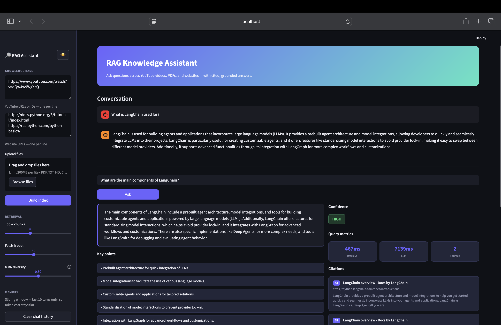
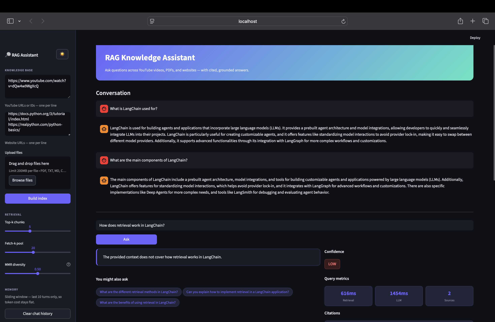
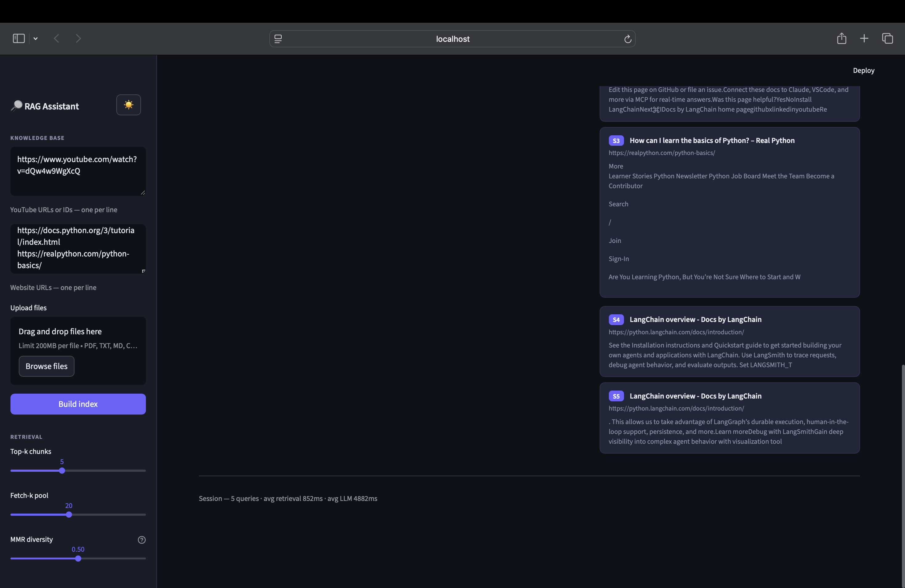

# RAG Knowledge Assistant

A personal knowledge base you can actually talk to. Point it at YouTube videos, PDFs, websites, or text files - it ingests everything, builds a searchable index, and answers questions with grounded, cited responses.

Built with Python, LangChain, OpenAI, FAISS, and Streamlit.

---

## What it does

- Ingests **4 source types** - YouTube transcripts, PDFs, plain text/markdown, and live websites
- Chunks and indexes documents using `text-embedding-3-small` with 900-token chunks and 180-token overlap into a local FAISS vector store that persists between sessions
- Retrieves with **MMR** (Maximum Marginal Relevance) — so you get diverse results instead of five chunks from the same paragraph
- Returns **structured answers** every time — grounded answer, key points, confidence level, follow-up questions, and source citations like `[S1]`, `[S2]`
- Shows **live query metrics** — retrieval latency, LLM latency, and session averages in the UI
- Supports **conversational follow-ups** via a sliding window memory (last 10 turns) — token cost stays flat regardless of session length

---

## Screenshots





## Tech stack

| Layer | Tool |
|---|---|
| LLM | `gpt-4o-mini` via OpenAI API |
| Embeddings | `text-embedding-3-small` |
| Vector store | FAISS (local, persistent) |
| Retrieval | MMR via LangChain |
| Structured output | Pydantic + `with_structured_output` |
| UI | Streamlit |

---

## Project structure

```
rag_knowledge_assistant/
├── app.py                       # Streamlit UI + session metrics
├── requirements.txt
├── .env.example
├── scripts/
│   └── build_sample_index.py    # CLI index builder
└── src/
    ├── chain.py        # RagAssistant — retrieve, answer, metrics
    ├── config.py       # Settings (models, chunk config)
    ├── ingest.py       # Multi-source document loader
    ├── models.py       # Pydantic output schema
    ├── splitter.py     # Text chunking
    ├── utils.py        # YouTube ID parsing + helpers
    └── vectorstore.py  # FAISS build / save / load
```

---

## Setup

**1. Clone and create a virtual environment**

```bash
git clone https://github.com/avdhi-2001/rag-knowledge-assistant.git
cd rag-knowledge-assistant
python -m venv .venv
source .venv/bin/activate        # Windows: .venv\Scripts\activate
```

**2. Install dependencies**

```bash
pip install -r requirements.txt
```

**3. Add your OpenAI API key**

```bash
cp .env.example .env
# open .env and paste your key: OPENAI_API_KEY=sk-...
```

**4. Run the app**

```bash
streamlit run app.py
```

Opens at `http://localhost:8501`

---

## How to use

### Option A — UI

1. Paste YouTube URLs or video IDs in the sidebar (one per line)
2. Paste website URLs (one per line)
3. Upload PDFs, `.txt`, `.md`, `.csv`, or `.py` files
4. Hit **Build index**
5. Type a question and click **Ask**

### Option B — Command line

```bash
PYTHONPATH=. python scripts/build_sample_index.py \
  --youtube https://www.youtube.com/watch?v=Gfr50f6ZBvo \
  --web https://python.langchain.com/docs/introduction/ \
  --files notes.txt report.pdf
```

Then open the app and query the saved index.

---

## Retrieval tuning

Three sliders in the sidebar let you tune retrieval in real time:

| Control | What it does |
|---|---|
| **Top-k chunks** | How many chunks get passed to the LLM as context |
| **Fetch-k pool** | How many candidates FAISS pulls before MMR re-ranks |
| **MMR diversity** | 0 = max diversity · 1 = max relevance |

---

## Why these technical choices

**MMR over pure similarity search** — cosine similarity alone tends to return near-duplicate chunks from the same paragraph. MMR re-ranks to spread results across different parts of the source material, so the model actually sees diverse evidence.

**900-token chunks with 180-token overlap** — the 20% overlap stops sentences at chunk boundaries from losing context. 900 tokens is big enough to capture a full paragraph without blowing the retrieval window.

**Sliding window memory** — storing the full chat history and sending it on every query means token cost grows linearly with conversation length. Capping it at 10 turns keeps both cost and latency predictable.

**`text-embedding-3-small`** — good quality-to-cost ratio for a project like this. The model is configurable via `.env` so swapping it requires no code changes.

---

## Running the tests

```bash
python -m pytest tests/ -v
```

13 unit tests covering `extract_youtube_video_id` — standard URLs, short URLs, Shorts links, embed links, plain IDs, and edge cases.
